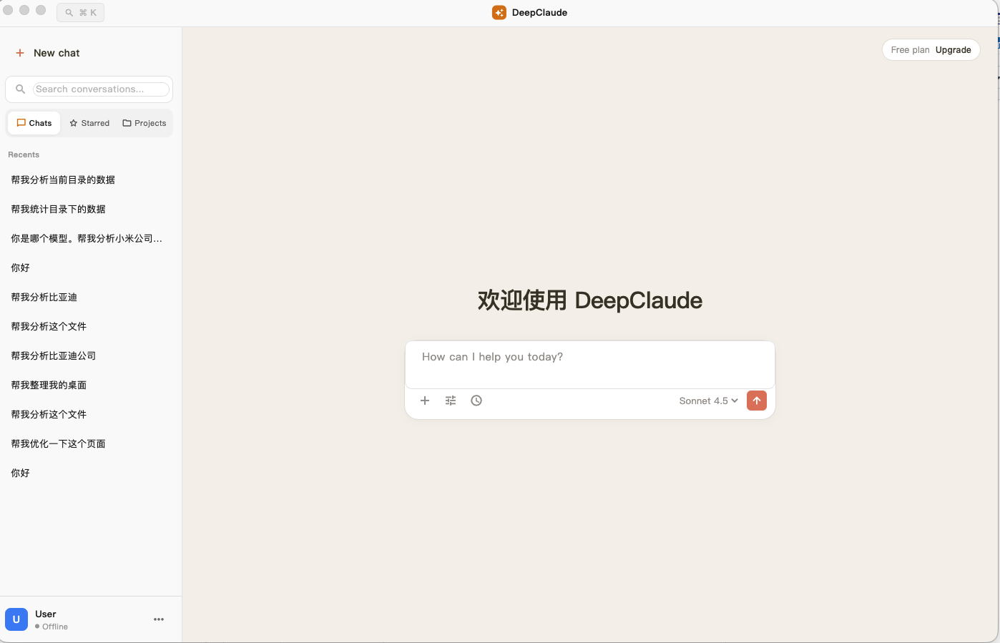
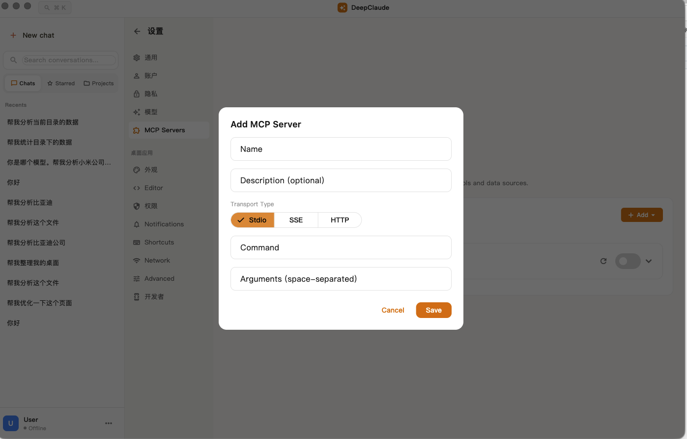
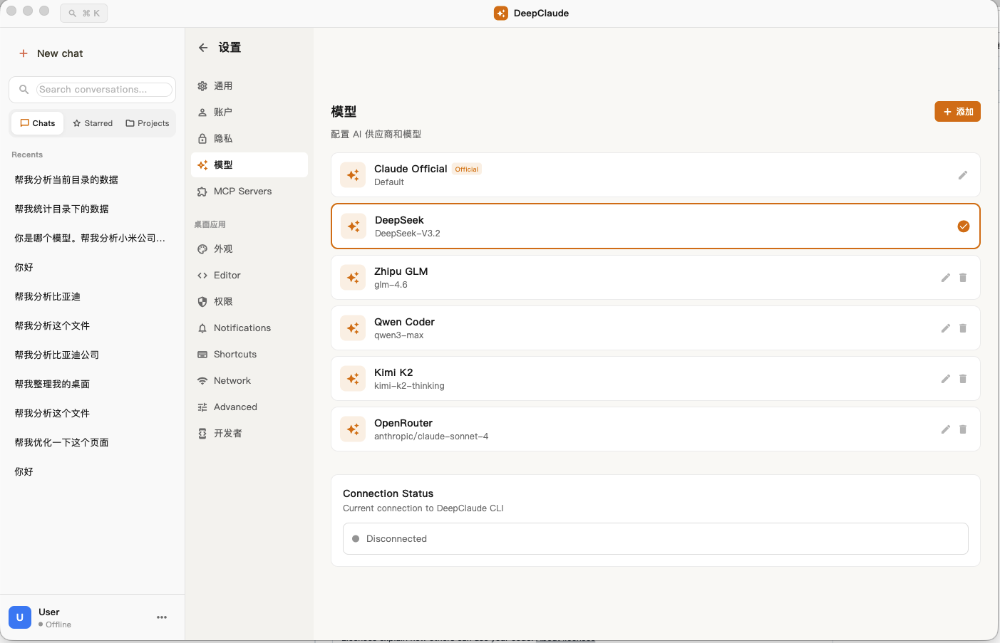

# DeepClaude

<p align="center">
  
</p>

<p align="center">
  <strong>🚀 基于 Flutter 开发的类 Claude Desktop 桌面客户端</strong>
</p>

<p align="center">
  支持国内大模型 · 跨平台 · 开源免费
</p>

<p align="center">
  <a href="#功能特性">功能特性</a> •
  <a href="#支持的模型">支持的模型</a> •
  <a href="#快速开始">快速开始</a> •
  <a href="#使用说明">使用说明</a>
</p>

---

## 简介

DeepClaude 是一款基于 Flutter 开发的开源 AI 桌面客户端，UI 设计参照 Claude Desktop，为国内用户提供流畅的 AI 对话体验。

**为什么选择 DeepClaude？**

- 🇨🇳 **支持国内模型** - 原生支持 DeepSeek、通义千问、智谱等国内大模型
- 🎨 **Claude 风格 UI** - 简洁优雅的界面设计，参照 Claude Desktop
- 💻 **跨平台支持** - macOS、Windows、Linux 全平台运行
- 🔓 **开源免费** - 完全开源，自由使用和定制
  
## 支持的模型

### 国内模型
| 模型 | 供应商 | 状态 |
|------|--------|------|
| DeepSeek-V3 | DeepSeek | ✅ 支持 |
| DeepSeek-R1 | DeepSeek | ✅ 支持 |
| Qwen-Max | 阿里云 | ✅ 支持 |
| Qwen-Plus | 阿里云 | ✅ 支持 |
| GLM-4 | 智谱 AI | ✅ 支持 |
| 文心一言 | 百度 | 🚧 计划中 |

### 国际模型
| 模型 | 供应商 | 状态 |
|------|--------|------|
| Claude 3.5 | Anthropic | ✅ 支持 |
| GPT-4 | OpenAI | ✅ 支持 |
| Gemini | Google | 🚧 计划中 |

## 功能特性

### 🤖 智能对话
- **流式响应** - 实时显示 AI 回复，打字机效果
- **思考过程** - 支持显示模型的思考过程（DeepSeek-R1）
- **多会话管理** - 支持多个对话同时进行

### 🔌 MCP 连接器
- **扩展能力** - 支持 MCP (Model Context Protocol) 连接器
- **Web 搜索** - 集成网络搜索能力
- **自定义工具** - 可配置多种 MCP 服务

### 📁 文件功能
- **文件预览** - 浏览和预览项目文件
- **附件上传** - 支持上传文件进行分析
- **代码高亮** - 支持多种编程语言语法高亮

### 🎨 用户体验
- **深色/浅色主题** - 支持主题切换
- **多语言支持** - 中文、英文、日文
- **历史记录** - 会话自动保存，随时查看

## 快速开始

### 环境要求

- Flutter 3.0+
- macOS / Windows / Linux

### 安装步骤

#### 1. 克隆项目

```bash
git clone https://github.com/your-username/DeepClaude.git
cd DeepClaude
```

#### 2. 安装依赖

```bash
flutter pub get
```

#### 3. 运行应用

```bash
# macOS
flutter run -d macos

# Windows
flutter run -d windows

# Linux
flutter run -d linux
```

### 生产构建

```bash
# macOS
flutter build macos --release

# Windows
flutter build windows --release

# Linux
flutter build linux --release
```

## 使用说明

### 配置 API Key

1. 打开设置（点击侧边栏底部的设置图标）
2. 选择「AI 供应商」
3. 选择你要使用的模型供应商
4. 输入对应的 API Key

### 开始对话

1. 点击「New chat」创建新对话
2. 在输入框输入消息
3. 按 Enter 发送

### MCP 连接器

1. 点击输入框左下角的时钟图标
2. 开启/关闭需要的连接器
3. 点击「Manage connectors」管理连接器配置

## 截图

<p align="center">
  
</p>

## 项目结构

```
lib/
├── main.dart                      # 应用入口
├── providers/
│   ├── chat_provider.dart         # 聊天状态管理
│   ├── settings_provider.dart     # 设置管理
│   ├── mcp_provider.dart          # MCP 连接器管理
│   └── provider_manager.dart      # AI 供应商管理
├── screens/
│   └── home_screen.dart           # 主界面
└── widgets/
    ├── sidebar.dart               # 侧边栏
    ├── chat_area.dart             # 聊天区域
    └── settings_panel.dart        # 设置面板
```

## 技术栈

- **框架**: Flutter 3.x
- **语言**: Dart
- **状态管理**: Provider
- **存储**: SharedPreferences + 本地文件

## 路线图

- [x] 基础对话功能
- [x] 国内模型支持（DeepSeek、Qwen）
- [x] MCP 连接器
- [x] 多主题支持
- [ ] 文心一言支持
- [ ] Gemini 支持
- [ ] 插件系统
- [ ] 云端同步

## 贡献

欢迎提交 Issue 和 Pull Request！

## 许可证

MIT License

## 致谢

- [Flutter](https://flutter.dev/) - UI 框架
- [DeepSeek](https://www.deepseek.com/) - AI 模型
- [Anthropic](https://www.anthropic.com/) - UI 设计灵感
